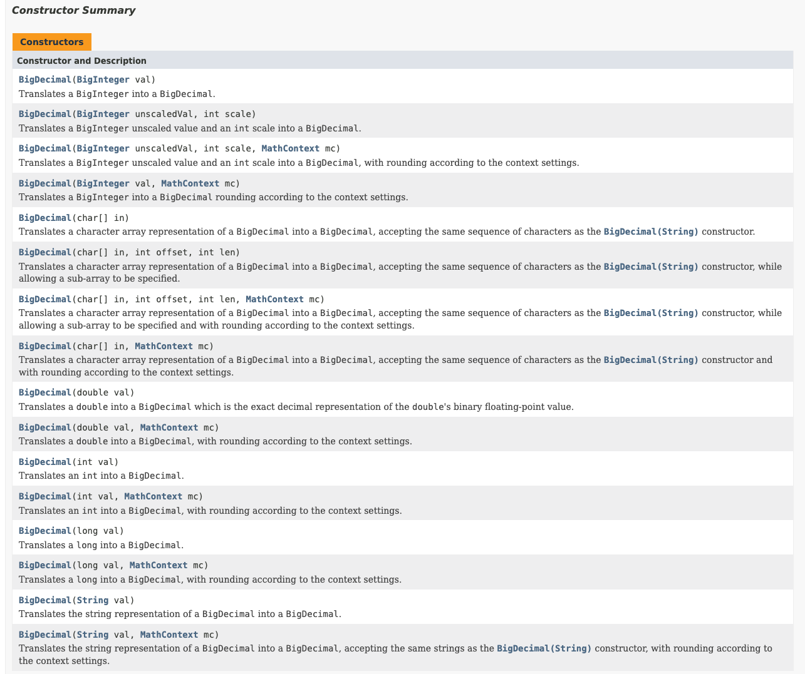
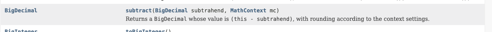

## API


#### 자바 API 공식 문서
#### https://docs.oracle.com/javase/8/docs/api/


- 문서에 Deprecated 표기는 현재는 사용하지 않는다는 의미

직접해보자
- BigDecimal 클래스의 용도가 무엇인가
```
The BigDecimal class provides operations for arithmetic, 
scale manipulation, rounding, comparison, 
hashing, and format conversion. 
The toString() method provides a canonical representation of a BigDecimal.

Big Decimal 클래스는 산술 연산을 제공합니다.
척도 조작, 반올림, 비교,
해싱 및 형식 변환을 사용할 수 있습니다.
toString() 메서드는 BigDecimal의 표준 표현을 제공합니다.
``` 
  - 부동소수점 문제를 해결한 정수 연산 MATH 클래스에서 제공하는 API 
  - 주로 금융에서 사용


- BigDecimal 클래스의 생성자가 몇개인가
  - 총 16개  
  

- BigDecimal 클래스의 메소드중 abs()의 용도는?

```
abs()
Returns a BigDecimal whose value is the absolute value of this BigDecimal, 
and whose scale is this.scale().
```
절대값을 반환해준다.
 

- BigDecimal 클래스에서 현재값에서 특정값을 빼는 연산을 수행하는 매소드는?
  - 
  - subtract(대상값,뺄값)
  - 값을 뺀 후 반올림해 반환한다. 

- BigDecimal 클래스에 있는 메소드 중 나누기 와 관련된 메소드는?
  - divide


-----


##### 1.API문서를 자동으로 생성하는 명령어는 무엇인가
- javadoc  (alt,shift,J)내기준
##### 2.API 왼쪽 상단에는 어떤 내용이 제공되나
##### 3.API 왼쪽 하단에 어떤 내용이 제공되나
##### 4.API 우측 화면 보통 내용이 제공되나요
##### 5.Deprecated
- 더 이상 사용되지 않는다는 의미

